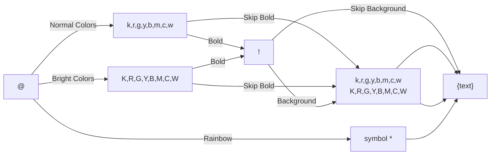

# Specification for MemoANSI Format

## Overview
The MemoANSI format is a string-based syntax designed for styling text with various colors, backgrounds, and boldness attributes. This format is particularly useful for adding visual emphasis to log messages or console output.

A MemoANSI Expression begins with the `@` symbol, followed by a sequence of codes that specify the text's style, and ends with `{text}`, where `text` is the styled content.

## Format Syntax
```
@<color><bold><background>{text}
```

### Components
1. **Start** The color expression must start with `@`
2. **Color Code**: The first character after `@` specifies the foreground color of the text.
3. **Boldness Flag** (optional): An exclamation mark (`!`) after the color code makes the text bold.
4. **Background Color Code** (optional): The next character specifies the background color of the text.
5. **Text**: Enclosed within `{}` brackets, this is the content to be styled.




### Examples
- `@r{red color}`: Text in red.
- `@R{bright red color}`: Text in bright red.
- `@r!{red bold color}`: Bold text in red.
- `@rW{red on white background}`: Text in red on a white background.
- `@r!W{red bold on white background}`: Bold text in red on a white background.
- `@*{Rainbow text}`: Rainbow-styled text (special case).

## Supported Color Codes
### Foreground Colors
| Code | Color            | Bright Variant Code | Bright Color         |
|------|------------------|---------------------|----------------------|
| k    | Black            | K                   | Bright Black (Gray)  |
| r    | Red              | R                   | Bright Red           |
| g    | Green            | G                   | Bright Green         |
| y    | Yellow           | Y                   | Bright Yellow        |
| b    | Blue             | B                   | Bright Blue          |
| m    | Magenta          | M                   | Bright Magenta       |
| c    | Cyan             | C                   | Bright Cyan          |
| w    | White            | W                   | Bright White         |

### Background Colors
The same codes used for foreground colors can also be used for background colors when placed after the boldness flag (if any).

## Usage Examples
Below are some examples demonstrating how to use the MemoANSI format in a logging library:

```go
slog.Info("Example of @r{red color}")
slog.Info("Example of @R{bright red color}")
slog.Info("Example of @r!{red bold color}")
slog.Info("Example of @rW{red on white background}")
slog.Info("Example of @r!W{red bold on white background}")
slog.Info("Example of @*{Rainbow text}")
```

## Special Case: Rainbow Text
The `@*{text}` expression applies a "rainbow" effect to the text. Each character is styled with a different color from the spectrum. This effect does not support boldness or background colors.

## Validation Rules
1. Every MemoANSI Expression must begin with `@`.
2. After the `@` symbol, there must be a valid color code.
3. The boldness flag (`!`) is optional and can only appear after the color code.
4. The last optional character before the `{` must be a valid color code if specifying a background color.
5. The opening `{` and closing `}` must encapsulate the text to style.


